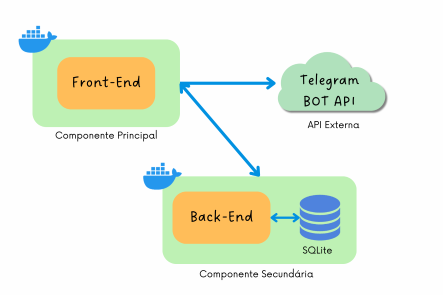

# Gestão de Validades de um Mini Mercado Autônomo (API)
## 1. Introdução

Este projeto é parte do MVP - _Minimum Viable Product_ - da _Sprint_ **Arquitetura de _Softwares_** do Curso de Engenharia de Software da PUC-Rio. O MVP é composto de um Front-End, que se comunica com uma API Externa (Telegram BOT API) e com um Back-End, com persistência de dados em um banco SQLite, conforme ilustrado na Figura abaixo. Neste repositório encontra-se a parte do Back-end da aplicação. A parte do front-end pode ser acessada em [MVP_Arquitetura_Front_End](https://github.com/CarolinaRamalhoGit/MVP_Arquitetura_Front_end).

>O projeto desenvolvido objetiva a facilitação de controle de datas de vencimento de produtos de um *Minimercado Autônomo*. Este tipo de empreendimento, que ganhou força durante a pandemia de Covid-19, funciona como uma loja de conveniências, sem funcionários, disponibilizadas em sua maior parte dentro de condomínios residenciais.

Devido ao seu baixo custo de implantação, este nicho de mercado atraiu pequenos empreendedores e vem apresentando um grande crescimento tanto em número de unidades instaladas quanto em número de franqueadoras que oferecem um grande suporte para o funcionamento dos mesmos, incluindo a solução tecnológica que possibilita a gestão de inventário e os meios de pagamentos, via totens de autoatendimento.

Uma das dores, contudo, encontradas pelos pequenos, e muitas vezes inexperientes, empreendedores é o controle da validade dos produtos ofertados, funcionalidade não disponível em algumas das principais soluções deste nicho de negócio.

>Desta forma, este projeto visa, de forma bastante simplificada, implementar uma aplicação web na qual seja possível consultar um banco de dados de uma lista dos produtos com suas respectivas quantidades e datas de validade, para que, de posse desta informação, os produtos possam ser substituídos na loja e novas compras de seu estoque possam ser providenciadas. Além da consulta, é possível a inserção de novos produtos e a alteração e exclusão de produtos já cadastrados.
  
  
## 2. Back-end

O back-end é a componente secundária da aplicação desenvolvida (vide Figura 1) e é responsável pela criação e manutenção do banco de dados da aplicação, bem como pelas rotas de requisição ao servidor. As rotas implementadas foram do tipo GET, POST, UPDATE e DELETE, e sua documentação pode ser acessada em Swagger, conforme instruções dos itens 3 e 4 do presente documento.

As principais tecnologias utilizadas no Back-End foram:
 - [Flask](https://flask.palletsprojects.com/en/2.3.x/)
 - [SQLAlchemy](https://www.sqlalchemy.org/)
 - [OpenAPI3](https://swagger.io/specification/)
 - [SQLite](https://www.sqlite.org/index.html)

## 3. Execução do Back-end
## 3.1. Como executar por meio do Docker

1. Certifique-se de ter o [Docker](https://docs.docker.com/engine/install/) instalado e **em execução** em sua máquina.

2. No terminal, navegue até o diretório que contém o Dockerfile e os arquivos de aplicação (MVP_API) e execute, **como administrador**, o seguinte comando para construir a imagem Docker:

        $ docker build -t nome_da_sua_imagem .

3. Uma vez criada a imagem, para executar o container com compartilhamento da base de dados entre o host e o guest, basta executar, **como administrador**, seguinte o comando:

        $ docker run --name nome_do_seu_container -v ${PWD}/database:/app/database -p 5000:5000 nome_da_sua_imagem

4. Uma vez que o container esteja sendo executado, para acessar a API, basta abrir o [http://localhost:5000/#/](http://localhost:5000/#/) no navegador.

## 3.2. Como executar sem o Docker
### 3.2.1. Pré-requisitos
- Recomenda-se o uso de ambientes virtuais do tipo [virtualenv](https://virtualenv.pypa.io/en/latest/installation.html).

- Faz-se necessária a instalação de todas as dependências/bibliotecas listadas no arquivo requirements.txt:

        (env)$ pip install -r requirements.txt

### 3.2.2. Execução
1. Para processar a API e consultar sua documentação em Swagger, executar:

        (env)$ flask run --host 0.0.0.0 --port 5000

2. Abra o [http://localhost:5000/#/](http://localhost:5000/#/) no navegador para verificar o status da API em execução.

## 4. Considerações
Por se tratar de um MVP, diversas funcionalidades da API não foram priorizadas neste momento, ficando sua implementação para as versões futuras da aplicação. Dentre as já mapeadas, destacam-se as listadas a seguir:

- Rota GET para busca de produtos por nome, para que um mesmo produto com diferentes datas de vencimento (validade) sejam vistos simultaneamente de forma clara;
- Separação da lista de produtos permitidos para o dropdown em outro arquivo, que seja acessível ao usuário;
- Notificações automáticas de produtos próximos ao vencimento.

